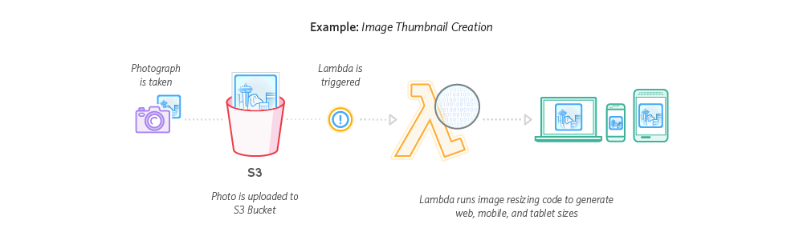

# Serverless Thumbnails


An Serverless AWS Lambda function that AWS S3 can invoke to create thumbnails or reduce file size for png and jpg images.

Features:
- Reduce jpg/png file size.  Image file size is reduced by more than 70%.
- PNG files with 100% support for transparency.
- Resize jpg/png based on configuration.

## Dependencies
- `node`, version: 4.x
- `Vagrant`, Required to build the deployment zip package. If you are already working on Linux system, you don't have to install Vagrant.

## How it works

Once you deployed **image-lambda** package to AWS Lambda and configured it. When an image is uploaded to AWS S3 bucket, S3 sends an notification to AWS Lambda and invokes the **image-lambda** function. **image-lambda** reduce/resize the image based on configuration and then put the processed images to target bucket/directory.


**image-lambda** use [GraphicsMagick](https://github.com/aheckmann/gm) to resize image, and [imagemin](https://github.com/imagemin/imagemin) to reduce image file size.

## Installation

```
git clone https://github.com/SlimFancy/image-lambda.git
cd image-lambda
npm install
```

## Configuration
**image-lambda** supports configuration for reduce/resize image. There is `config.json.sample` in project root directory as example. You can copy to use it.

```
$ cp config.json.example config.json
```

Here is an example of configuration:

```
{
  "reduce": {
    "sourceDir": "images/uploads",
    "targetBucket": "example",
    "targetDir": "images/reduce",
    "ACL": "public-read"
  },
  "resizes": [
    {
      "width": 100,
      "sourceDir": "images/uploads",
      "targetBucket": "example",
      "targetDir": "images/100w",
      "ACL": "public-read"
    },
    {
      "width": 200,
      "sourceDir": "images/uploads",
      "targetBucket": "example",
      "targetDir": "images/200w",
      "ACL": "public-read"
    },
    {
      "height": 200,
      "sourceDir": "images/uploads",
      "targetBucket": "example",
      "targetDir": "images/200h",
      "ACL": "public-read"
    }
  ]
}
```
- `reduce`: Define params for reduce image.
- `resizes`: Define different image sizes. This example creates 3 thumbnails with different sizes.
- `targetDir`: the output path which is appended with filename `${targetDrit}/${filename}`
- `ACL`: *private | public-read | public-read-write | authenticated-read | aws-exec-read | bucket-owner-read | bucket-owner-full-control*. Controls the permission of generated images.
- `targetBucket`: Specify the bucket where you want to put the generated images.
- `width/height`: It's better to just specify one of them, the other side can be resized based on the ratio.


## Deploy using serverless

1. `npm install`
2. `serverless deploy -s prod`
## Test function locally
Its possible to test the function without deploying. 
0. Upload example image file and save key name.
1. Refer the correct key name and bucket in `/test/fixture/event.json` 
2. `sls invoke local -f thumbnail -p test/fixture/event.json`
3. This will pull S3 into local execution of the function, then processing, and upload back to S3.

## Contributing

If you'd like to contribute to the project, feel free to submit a PR.

Run tests:

```
$ npm test
```

`test/fixture` directory contains jpg and png images for testing. After you run tests, the reduced and resized images are stored in `test/out`.

## License

MIT
